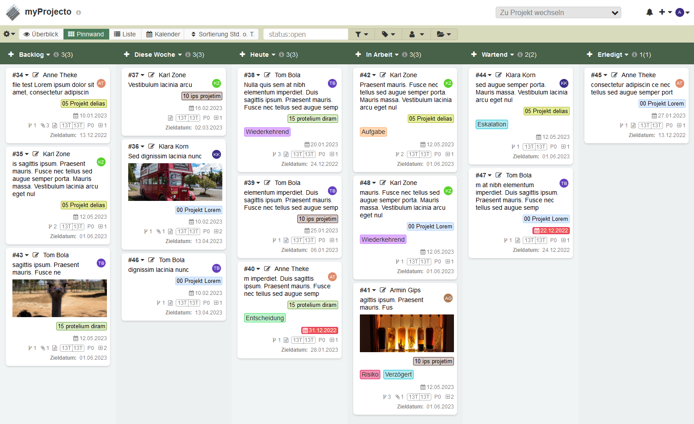
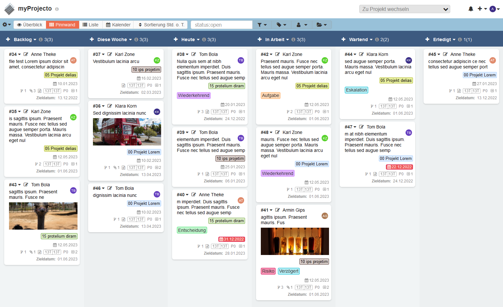

 Use the table of contents

[](https://github.com/JustFxDev/ThemeMaestro/releases) [](https://github.com/JustFxDev/ThemeMaestro/blob/main/LICENSE) [](https://github.com/JustFxDev/ThemeMaestro/graphs/contributors)

**:star: If you use it, you should star it on GitHub!** *It's the least you can do for all the work put into it!*

# Theme Maestro

A theme with few color options for [Kanboard](https://github.com/kanboard/kanboard) that also supports various plugins for Kanboard.

## Features

- Can be customized to your own color preferences
- Three (four) color sets are already included: Red, Blue, Green and Colorful Headers
- Due date is displayed in red on the card when it's missed
- Many small things in the design have been improved
- Some plugins are considered in the CSS
- With a little effort, each board can use its own colors for the headers (background and font) via the board ID and CSS for that board. Needs CustomUserCSS plugin or direct editing of the included CSS sections

## Screenshots

#### Theme Red


#### Theme Green  


#### Theme Blue  


#### Theme Blue Colorful  
 

## Recommended plugins

A list of plugins that you might recognize from the screenshots or that have proven to be a good addition to Kanboard Core in general

| Plugin                                                       | Provides                                                     |
| :----------------------------------------------------------- | :----------------------------------------------------------- |
| [ColorManager](https://github.com/aljawaid/ColorManager)     | Adds 50 more colors to the base system for tasks, tags and categories and also allows to create custom colors for them. Must have. |
| [Boardcustomizer](https://github.com/TimoStahl/kanboard_plugin_boardcustomizer) | Allows to show and hide different elements for each user. In particular, it is possible to hide icons on tasks that are not needed. |
| [Customizer](https://github.com/creecros/Customizer)         | Creates the possibility to display your own logo in the page header.  You can design the login page yourself and display a logo there as well. The favicon can be easily changed and many things more. |
| [Taglist](https://github.com/TimoStahl/kanboard_plugin_taglist) | Provides a drop down selector in Board header for filtering by tags to display only the tasks that contain a specific tag. It can also filter tasks that do not have tags. |
| [DueDate](https://github.com/JustFxDev/kanboard-duedate)     | Adds a drop down in the header to sort all tasks in all columns by due date or last modified date. The display can be switched back to the default sorting and vice versa with one click. |
| [MarkdownPlus](https://github.com/creecros/MarkdownPlus)     | Allows to use emojis HTML, check boxes and similar in the task description and comment fields. |
| [PITM](https://github.com/Chaosmeister/PITM)                 | Paste Image to Markdown - Requires MarkdownPlus. Allows to paste images into descriptions and comments. |
| [Metamagik](https://github.com/creecros/MetaMagik)           | Allows adding custom fields to tasks and displaying them on the task card and the task properties. |
| [KanboardCommentActions](https://github.com/ipunkt/KanboardCommentActions) | Creates a drop down below the comment input box to immediately assign the task to another project or board member. |

## Compatibility

Requires [Kanboard](https://github.com/fguillot/kanboard "Kanboard - Kanban Project Management Software") ≥`v1.2.20`

Important: If you use the [Customizer](https://github.com/creecros/Customizer) plugin, make sure that the Customizer theme selection is set to the *Default* option.

## Installation

Options for the installation:

1. Installation via the plugin manager in Kanboard (recommended).
2. Download the zip file from the release folder here in the repository and unzip it in the directory `plugins/ThemeMaestro` (recommended)
3. Clone the repository (current master) into the directory `plugins/ThemeMaestro` (not recommended)

Note: All names in the plugin directory are case-sensitive

**Important: all unused themes / all other themes should be removed from the plugins directory before using this theme (Kanboard can't handle multiple themes by now)**. 

## Configuration

### Set up the default coloring for tasks

It is recommended to install the [ColorManager](https://github.com/aljawaid/ColorManager) plugin and set "Bright White" as default color for the tasks in the Kanboard settings section / Project settings / default task color. If you do so, all new tasks are created with a white background and white left border.

You can color each task cards left border with one of the numerus colors of this plugin.

#### Change the main color scheme of the theme

The theme consists mainly of the following CSS files:

```
ThemeMaestro/Assets/css/
   theme_maestro.css          // Basis setup
   blue.css                   // color blue definitions
   green.css                  // color green definitions
   red.css                    // color red definitions
   column_colors_multi.css    // multi color headings 
   column_colors_none.css     // no multi color headings
```

This looks more complicated than it is. The main file `theme_maestro.css` includes the differences at the top of the file. Be sure that you only include **one** of the css color files and **one** of the css column color files.

```css
/*  main colors and vars include your favorit color.css here */

/* @import url("./red.css"); */
@import url("./blue.css");
/* @import url("./green.css"); */

/*  Include column header colors for all boards and         */
/*  column header colors for specific boards                */
/*  if you wish to have different header colors per column  */

/* @import url("./column_colors_multi.css"); */
@import url("./column_colors_none.css");
```

You change in the CSS file, which color file the theme should use. If you want to create your own colors, then you simply copy e.g. `blue.css` and rename the file. 

For example to `amber.css` Then make the desired adjustments for the colors in this new file and integrate these `@import url(./amber.css)` instead of the `@import url(./blue.css)` e. g.

#### Change the color in the column headers

If you like it a bit more colorful you have the following options:

##### Colored column headers for all boards for all users

Make sure to include `column_colors_multi.css` in `theme-maestro.css` see above. It comes with a few predefined header colors.

Open and edit  `column_colors_multi.css` and set your prefered colors . This CSS file is well document and you can easily figure out what to change how:

##### All header fonts colors for all boards

```css
/* column headers font  */
.board-column-title .dropdown-menu {
    text-decoration: none;
    color: #fff;
}
.board-column-header-task-count {
    color: #ffffff;
}
```


##### Column 1 header background color for all boards

```css
/* Column 1 */
#board th.board-column-header:nth-child(1) {
    background-color: #30bfbf;
}
```

This part sets the background color for the first column of **every** board in your Kanboard instance. It can be overwritten with the [CustomUserCSS](https://github.com/PapeCoding/kanboard-CustomUserCSS) plugin on a per user basis. Unfortunately that plugin has a seroius bug: it can only handle user CSS up to 255 chars.


##### Coloring a specific column header for one specific board

It is possible to set a color to a specific column on a specific board. To do so you have to identifiy the ID of the target board
- Open your board
- Have a look into the address bar of your browser 
- Check the string `&project_id=xxx` in the address bar

Let's say the ID is `326` and you want to set a red background to the first column header (= `nth-child(1)`) only in that board. So here we go: 

```css
/* Example board with ID 326 first column header colored RED */
.board-project-326 th.board-column-header:nth-child(1) {
    background-color: #f00000!important;
}
```

This is very uncomfortable. But keep in mind this is the first public version of the theme.


## Possible further development

- Improve all over design glitches (e. .g input boxes in task edit view etc.)
- Allow to create additional color sets for the theme in the main setup of the Kanboard instance
- Edit existing color sets
- Delete color sets
- Implementation of a color selector for each column header in `project settings / columns` to set color for background and font for that specific project / board.


Authors & Contributors
----------------------

- [@JustFxDev (Fx)](https://github.com/JustFXDev) - Author
- [@aljawaid](https://github.com/aljawaid) - Contributor
- Benno Waldhauers [WeKanboard Theme](https://github.com/bw-hro/WeKanboard) - Inspiration, CSS
- _Contributors welcome_
- _Help is needed especially for upcoming php plugin programming, but also for css / design improvements or just additional coloring schemes._


License
-------
- This project is distributed under the [MIT License](../main/LICENSE "Read The MIT license")
